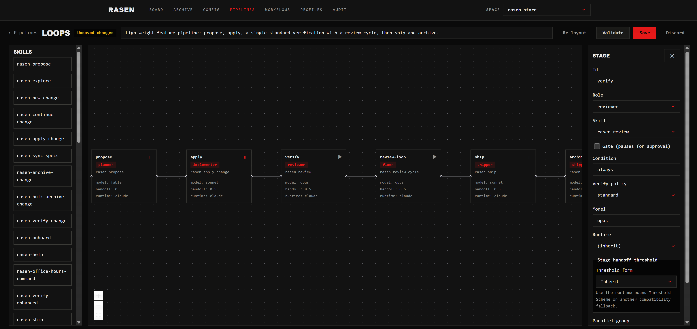
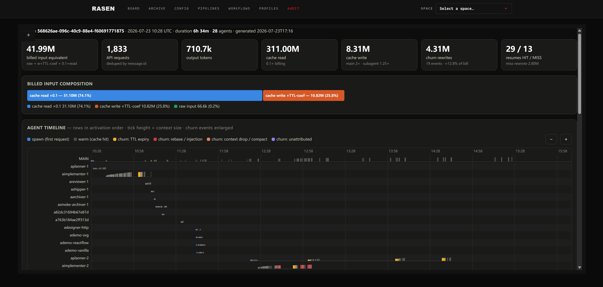

<h1 align="center">Rasen — loops that ascend</h1>

<p align="center"><strong>「순환이 아니라, 나선」</strong></p>

<p align="center">
  <a href="https://github.com/DumoeDss/rasen/actions/workflows/ci.yml"></a>
  <a href="https://rasen.io/ko/docs/"></a>
</p>

<p align="center">
  <a href="./README.md"></a>
  <a href="./README_zh.md"></a>
  <a href="./README_ja.md"></a>
  <a href="./README_ko.md"></a>
</p>

**Rasen**은 자율 하니스입니다 — 코딩 에이전트의 내부 루프를 감싸는, 설계된 **외부 루프**입니다. 당신은 의도만 전달하면 됩니다 — 목표, 버그, 기능 요청 — 하니스가 스스로 제안 → 구현 → 리뷰 → 수정 → 배포 → 보관을 진행하며, 작업이 끝날 때까지 반복합니다. 소프트웨어 개발의 자동변속기: **코드가 아니라 아이디어를 다루세요.**

## 원이 아니라, 나선

출발점으로 되돌아오는 루프는 그저 원일 뿐입니다. Rasen(螺旋, "나선")은 위로 올라가는 루프의 형태입니다. 그것이 이 도구의 전부이며, 실제 동작 방식과 그대로 맞물립니다:

- **의도가 기원이다.** 모든 변경은 당신이 써야 하는 문서가 아니라, 당신이 원하는 것에서 시작한다 — 목표, 버그 리포트, 기능 요청. 하니스가 그것을 `rasen/` 워크스페이스에 기록하고 바로 작업에 들어간다: `/rasen-propose → apply → archive`. 그 과정에서 나오는 스펙은 파이프라인이 스스로 쌓아가는 작업 기억일 뿐, 당신에게 돌아오는 숙제가 아니다.
- **루프가 형태입니다.** 작업은 한 번의 워터폴 통과가 아니라 주기로 진행됩니다. `rasen` 파이프라인 패밀리 — `small-feature`, `bug-fix`, `full-feature`, `auto-decompose` — 가 작업을 propose, implement, review, ship의 루프로 빚어냅니다.
- **한 바퀴마다 상승합니다.** 하니스는 단순 반복이 아니라 전진합니다. `/rasen-auto`는 LEAD를 세워 역할이 분리된 서브에이전트, 스스로의 실수를 잡아내는 리뷰 사이클, 세션을 넘어 컨텍스트를 이어주는 handoff/릴레이를 오케스트레이션합니다 — 매 바퀴가 시작보다 높은 곳에서 끝나도록.
- **돌파할 때까지.** `/rasen-goal`은 문서가 아니라 조건으로 나선을 닫습니다: 지표를 목표치까지 끌어올리고, 모듈을 루브릭 통과 수준으로 다듬고, 브리프에 답이 나올 때까지 리서치합니다 — gate가 충족될 때까지 modify → judge를 반복합니다.

의도가 출발점이고, 나선은 도달하는 방식입니다.

## 실제 동작 예시

```text
사용자: /rasen-auto full-feature 다크 모드를 추가하고 싶지만 깔끔하게 구현하는 방법은 아직 잘 모르겠습니다.
AI:  파이프라인: full-feature (명시 지정)
     첫 단계: office-hours. 먼저 설계를 검증하겠습니다.
AI:  첫 번째 핵심 분기: 하나의 공유 token 레이어를 사용할지,
     컴포넌트마다 테마 로직을 반복할지 결정해야 합니다. 편차를 줄이는 CSS 변수를 권장합니다.
     공유 token 레이어를 선택할까요?
사용자: 네——공유 token 레이어를 사용하겠습니다.
AI:  다음 분기: 기본적으로 시스템 테마를 따르고 수동 설정을 저장할까요?
     예측 가능하고 의존성이 추가되지 않으므로 이 방식을 권장합니다.
     이 방향으로 진행할까요?
사용자: 네——승인합니다.
AI:  설계를 승인하고 office-hours 설계 문서를 작성했습니다.
     ✓ office-hours — 방향 승인 및 기록 완료
     LEAD가 역할별로 분리된 워커와 함께 full-feature 파이프라인을 계속 진행했습니다.
     ✓ propose — 의도를 change 산출물로 정리
     ✓ apply — 다크 모드 구현 완료
     ✓ expert reviews — 코드 리뷰, 디자인 리뷰, QA 통과
     ✓ review-cycle — 발견된 문제 1건 수정 후 재검토 통과
     ✓ ship — 전달 내역 기록
     ✓ retain — 재사용할 수 있는 교훈 평가
     ✓ archive — spec 동기화
     완료. 다크 모드를 배포했습니다.
```

## 설치

**Node.js `>=20.19.0`**이 필요합니다.

```bash
npm i -g @atelierai/rasen
```

그다음 프로젝트에서 초기화합니다:

```bash
cd your-project
rasen init
```

`rasen init`은 `rasen/` 워크스페이스(specs와 changes)를 만들고, 당신의 AI 코딩 도구에 `/rasen-*` 슬래시 명령을 설치합니다.

업그레이드 후 AI 가이드를 갱신하고 최신 슬래시 명령을 받으려면:

```bash
rasen update
```

## 무엇을 얻게 되나

- **의도 기반 워크플로우** — 무엇을 만들지 말하기만 하면 된다. 하니스가 작업하는 동안 제안서, 스펙, 설계, 작업 목록을 담은 폴더를 스스로 생성하고 유지한다 — 당신이 직접 쓸 필요가 없다: `/rasen-propose → /rasen-apply-change → /rasen-archive-change`.
- **`rasen` 파이프라인 패밀리** — `small-feature` / `bug-fix` / `full-feature` / `auto-decompose`가 데이터(YAML)로 제공됩니다; `rasen pipeline show|list|classify|resume`으로 확인하고, `rasen pipeline import|export`로 설치형 패키지로 공유하거나, web UI의 파이프라인 캔버스에서 드래그 앤 드롭으로 직접 조립하세요. 작업 유형 추가는 파일 하나 추가, 코드는 제로.
- **`rasen ui` 관리 플랫폼** — 로컬 web UI: 작업 보드, 터미널보다 오래 살아남는 감독형 headless 에이전트 세션, 파이프라인 캔버스, config/workflow/profile 관리. [Web UI](#web-ui) 참조.
- **`/rasen-auto` 오토파일럿** — 명령 하나로 에이전트가 **LEAD**가 되어 역할이 분리된 서브에이전트(planner / implementer / reviewer / fixer / shipper)를 파이프라인 전체에 걸쳐 오케스트레이션하고, gate에서만 멈춥니다.
- **`/rasen-goal` 목표 주도 반복** — `/rasen-auto`의 자매 명령으로, "완료"가 문서가 아니라 조건인 작업을 위한 것입니다(Lighthouse를 90까지 올리기, 모듈을 루브릭 통과 수준으로 다듬기, 리서치해서 브리프 쓰기). LEAD가 작업을 measure / evaluate / research 백엔드로 분류하고, gate가 충족되거나 라운드 상한에 도달할 때까지 modify → judge를 반복합니다.
- **Auto-decompose** — 리뷰 가능한 diff 하나에 담기엔 너무 큰 작업을, 의존성 DAG와 보수적인 직렬/병렬 정책과 함께 독립적으로 배포 가능한 자식 change들로 분할합니다.
- **chrome-use** — CDP로 실제 Chrome을 조작하는 전문가: 탐색, 클릭, 네트워크 캡처, JS 주입, cookie와 `localStorage` 읽기, 요청 대기 — 로그인이 필요한 페이지, SPA, 단순 fetch로는 닿지 않는 모든 것을 위해.
- **컨텍스트 감지와 handoff** — `rasen agent context`가 실제 점유율을 측정하고; `/rasen-handoff`가 증류된 체크포인트를 기록하며; worker는 소프트 예산에서 스스로 교대하고, compact 복구 훅이 auto-compact 후 세션을 증류물에 다시 고정합니다 — 긴 작업이 컨텍스트 한계를 버텨내도록.
- **프롬프트 캐시 킵얼라이브** — `rasen agent wait`는 유휴 worker를 킵얼라이브 비트에 정박시켜 5분짜리 프롬프트 캐시가 만료되지 않게 합니다 — implementer를 기다리는 reviewer가 다음 턴에 전체 컨텍스트 재작성 비용을 치르지 않습니다. 비트 길이는 `keepalive.beatSeconds`로 조절합니다.
- **토큰 감사** — `rasen agent audit`는 세션의 토큰이 실제로 어디에 쓰였는지 보여줍니다: 에이전트별 소비, 캐시 churn과 그 원인, 번들 HTML 뷰어 포함. Claude Code 트랜스크립트와 Codex 롤아웃을 모두 지원하며, 완전 로컬 — 아무것도 업로드하지 않습니다.

## Web UI

CLI 곁에는 브라우저 기반 관리 플랫폼이 있습니다. CLI 옆에 UI 패키지를 설치한 뒤 실행하세요:

```bash
npm i -g @atelierai/rasen-ui
rasen ui
```

`rasen ui`는 상주 백그라운드 데몬을 시작(또는 연결)하고 — 127.0.0.1에만 바인딩, 세션별 토큰 — 앱을 엽니다:

- **Board** — 활성 change를 Task 단위로 라이프사이클 열에 배치. 스페이스 스위처로 모든 프로젝트와 store를 넘나듭니다.
- **Sessions** — 브라우저에서 headless `/rasen-auto` / `/rasen-goal` 실행을 시작하고, 출력을 지켜보고, 클릭 한 번으로 종료. 터미널을 닫아도 살아 있습니다.
- **파이프라인 캔버스** — 어떤 파이프라인이든 DAG로 보고, 스킬을 캔버스로 끌어와 새 파이프라인을 조립. 저장 전 서버 측 검증이 실행됩니다.
- **Config / Workflows / Profiles** — 상속 출처가 보이는 계층형 설정, 스페이스별로 켜고 끌 수 있는 설치형 워크플로 라이브러리, 이름 있는 워크플로 프로파일.

### 0.1.5 Web UI

**Pipeline Canvas** — 단계 그래프를 편집하고, 의존성을 검증하며, 역할·런타임·모델·핸드오프 설정을 조정합니다.



**Session Audit** — token 합계와 캐시 구성을 비교하고 에이전트와 캐시 churn 이벤트를 타임라인에서 추적합니다.



## OpenSpec과의 공존

Rasen은 업스트림 OpenSpec과 충돌 없이 **나란히** 살도록 설계되었습니다. 모든 인터페이스가 별도의 네임스페이스이므로, 같은 프로젝트에 둘을 동시에 설치할 수 있습니다:

| 인터페이스 | OpenSpec | Rasen |
| --- | --- | --- |
| 바이너리 | `openspec` | `rasen` |
| 슬래시 명령 | `/opsx:*` | `/rasen-*` |
| 스킬 | `openspec-*` | `rasen-*` |
| 워크스페이스 | `openspec/` | `rasen/` |

네임스페이스가 겹치지 않기 때문에, rasen 설치가 기존 OpenSpec 구성을 방해하는 일은 없습니다 — 먼저 제거해야 할 것도 없습니다.

기존 `openspec/` 워크스페이스를 rasen으로 가져오고 싶다면:

```bash
rasen migrate
```

`rasen migrate`는 **복사 전용(copy-only)**입니다: `openspec/{specs,changes,config.yaml}`을 `rasen/`으로 복사하고, 이미 존재하는 대상은 건너뜁니다. 원래의 `openspec/` 디렉터리는 **절대 수정되거나 삭제되지 않습니다** — OpenSpec으로 계속 그대로 사용할 수 있습니다.

## 텔레메트리와 프라이버시

Rasen은 어떤 명령이 사용되는지 파악하기 위해 익명 사용 텔레메트리를 수집합니다. 전송되는 것은 **명령 이름, rasen 버전, 익명 UUID, OS와 Node 버전뿐**이며 — **경로, 인자, 프로젝트 데이터는 절대 전송되지 않습니다**.

옵트아웃하려면 다음 중 하나를 설정하세요:

```bash
export RASEN_TELEMETRY=0
# 또는 도구 공통 표준:
export DO_NOT_TRACK=1
```

CI 환경에서는 텔레메트리가 **자동으로 비활성화**됩니다.

## 커뮤니티

<p>
  <a href="https://discord.gg/JbWScy4y9K">
    
  </a>
</p>
