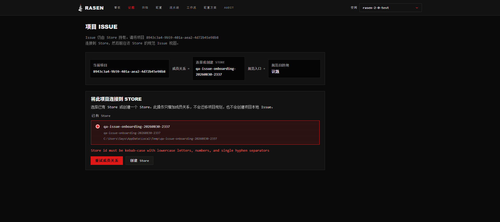
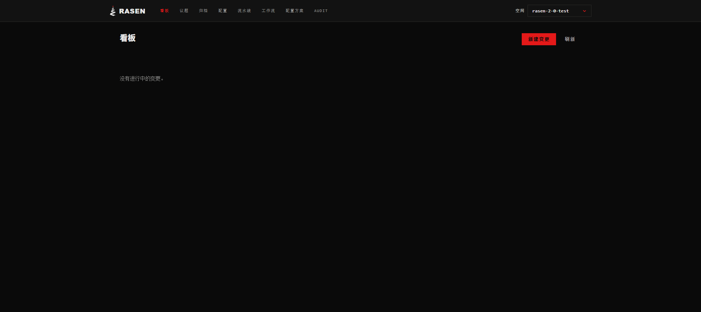
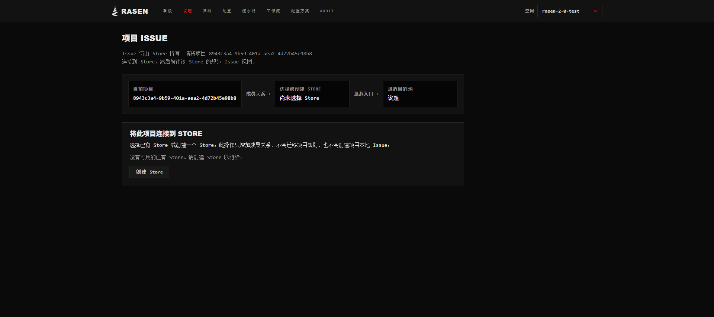
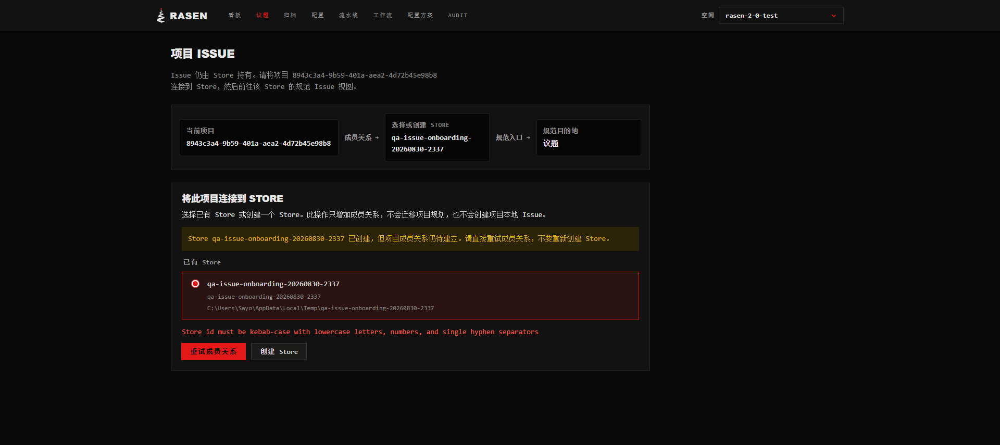
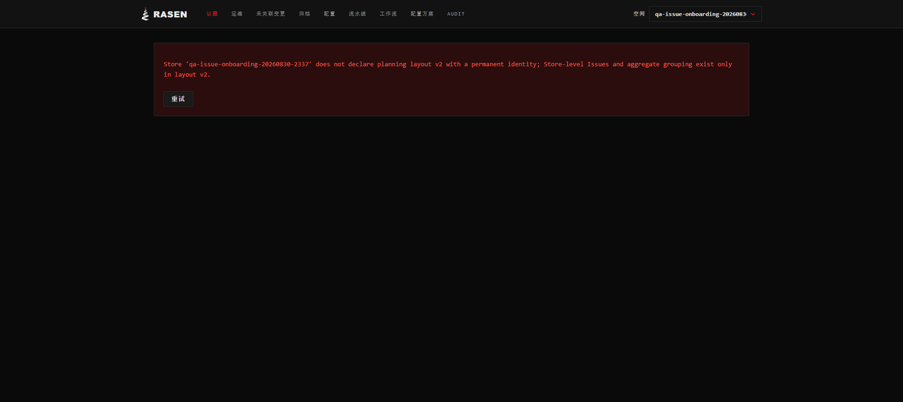
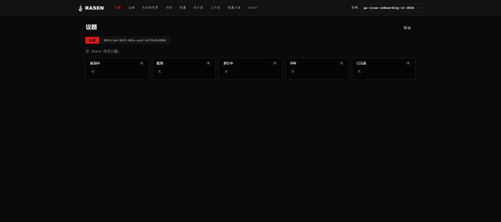

# QA Report: Project Issue Onboarding

| Field | Value |
|-------|-------|
| **Date** | 2026-08-31 |
| **URL** | `http://127.0.0.1:42544/s/qa-issue-onboarding-v2-20260831/issues` |
| **Branch** | `feat/project-issue-onboarding` |
| **Commit** | `738050ca` |
| **PR** | — |
| **Tier** | Standard, diff-aware |
| **Scope** | Project Board → Issues discovery → zero-membership Store creation → membership → canonical Store Issues |
| **Framework** | Preact SPA, release-shaped local CLI/UI pair |
| **Release-shaped fingerprint** | `f32fdb5d8970991837f425f94b5d2827164acf9eed3098ff3f941f75425fbfbe` |

## Health Score: 99/100 (final current-runtime verification)

| Category | Score |
|----------|-------|
| Console | 100 |
| Links | 100 |
| Visual | 100 |
| Functional | 100 |
| UX | 95 |
| Performance | 100 |
| Content | 100 |
| Accessibility | 95 |

## Summary

| Severity | Count |
|----------|-------|
| Critical | 0 |
| High | 0 |
| Medium | 0 |
| Low | 0 |
| **Total** | **0 open; 2 resolved** |

## ISSUE-001: Registered Project with a non-kebab folder cannot finish membership

| Field | Value |
|-------|-------|
| **Canonical severity** | Major |
| **QA severity** | high |
| **Category** | functional / UX / console |
| **Status** | resolved with current serving runtime |

The real target Project is already registered as
`8943c3a4-9b59-401a-aea2-4d72b45e98b8`, while its directory basename is
`rasen-2.0-test`. The new Project Issues entry and zero-membership onboarding
render correctly. Creating a Store succeeds with HTTP 201, but the immediately
following exact membership request receives HTTP 422 with `cli_error` and
`Store id must be kebab-case with lowercase letters, numbers, and single
hyphen separators`.

The UI correctly treats this as partial success: it keeps the created Store,
does not claim membership, and offers an idempotent membership-only retry.
Retrying reproduces the same 422. The error is therefore below the UI seam:
the CLI attempts to derive a Project display id from the non-kebab folder name
instead of reusing the Project identity already registered for that canonical
root.

### Stale-runtime checkpoint (superseded, retained as debugging evidence)

The release-shaped CLI/UI pair was rebuilt from the dirty
`feat/project-issue-onboarding` worktree at commit `738050ca`. The build
completed successfully with fingerprint
`7ad55647af7975d773950acb3e6eb1f17ef302c3800e3b2f811f20f52227921a` and
was intended to serve the UI on `http://127.0.0.1:42544`. Investigation later
proved that port was still owned by stale runtime `0.2.0-3b566...`, so the
following 422 result did not exercise the rebuilt product behavior.

Starting from the exact route
`/p/8943c3a4-9b59-401a-aea2-4d72b45e98b8/issues`, the zero-membership UI
listed the existing Store `qa-issue-onboarding-20260830-2337` at
`C:\Users\Sayo\AppData\Local\Temp\qa-issue-onboarding-20260830-2337`.
Selecting it exposed the expected membership action. The first submission and
the instructed **Retry membership** action both produced the same sanitized
browser-layer evidence:

- request operation: `add-project-to-store`
- request `projectId`: `8943c3a4-9b59-401a-aea2-4d72b45e98b8`
- request `storeId`: `qa-issue-onboarding-20260830-2337`
- `POST /api/v1/spaces` → `422`
- response `code`: `cli_error`
- response `message`: `Store id must be kebab-case with lowercase letters,
  numbers, and single hyphen separators`

The sanitized request fields prove the browser sent the canonical Project id
and the unprefixed, valid Store id. This keeps the failure boundary below the
UI request-construction seam.

The final URL remained
`/p/8943c3a4-9b59-401a-aea2-4d72b45e98b8/issues`; automatic navigation to
`/s/qa-issue-onboarding-20260830-2337/issues` did not occur, and the Store
Issue Board did not render. The recoverable failure state is visible here:

### Membership-fix checkpoint (resolved, 2026-08-31)

The stale daemon was stopped through the local harness `daemon stop` command;
port 42544 stopped serving on the first bounded check. The already-built
runtime was then started with `ui --no-open`. The serving process was matched
to the prepared runtime without exposing its command line:

- requested fingerprint:
  `7ad55647af7975d773950acb3e6eb1f17ef302c3800e3b2f811f20f52227921a`
- serving runtime:
  `0.2.0-7ad55647af7975d773950acb3e6eb1f17ef302c3800e3b2f811f20f52227921a`

From `/p/8943c3a4-9b59-401a-aea2-4d72b45e98b8/issues`, the existing named
Store was selected and the browser emitted this sanitized request/result:

- request operation: `add-project-to-store`
- request `projectId`: `8943c3a4-9b59-401a-aea2-4d72b45e98b8`
- request `storeId`: `qa-issue-onboarding-20260830-2337`
- `POST /api/v1/spaces` → `200`
- response operation: `store-add-project`
- response Store: `qa-issue-onboarding-20260830-2337`
- response error `code` / `message`: absent

The UI automatically navigated to the exact route
`/s/qa-issue-onboarding-20260830-2337/issues`. This resolves ISSUE-001: the
registered UUID is now reused despite the Project root basename
`rasen-2.0-test`.

### Reproduction

1. Open the existing Project Board. The header now contains the Project Issues
   entry.
   
2. Open Issues. The zero-membership state explains Store ownership and offers
   Store creation.
   
3. Create a Store under the isolated QA runtime's temporary directory. Observe
   HTTP 201 for `create-store`, followed by HTTP 422 for
   `add-project-to-store`.
4. Retry membership. Observe the same 422 and the recoverable partial-success
   state.
   

## ISSUE-002: Named QA Store cannot render the canonical Issue Board

| Field | Value |
|-------|-------|
| **Canonical severity** | Major |
| **QA severity** | high |
| **Category** | functional / fixture integrity / console |
| **Status** | resolved as a legacy-layout checkpoint |

After the successful membership and exact navigation, the three Store
aggregate reads (`issue-projections`, `issue-attention`, and `projects`) return
HTTP 400 with `issue_scope_required`. The shared response message states that
Store `qa-issue-onboarding-20260830-2337` does not declare planning layout v2
with a permanent identity. The canonical Board therefore renders a retryable
error instead of usable Issue content. One UI retry reproduces the same state.

The legacy Store was intentionally not migrated, deleted, or reused for the
final pass. It remains intact as failure evidence. ISSUE-002 is resolved by
proving that the current fixed create-store path produces a fresh layout-v2
Store with permanent identity and a usable canonical Board.

## Final current-runtime verification (2026-08-31)

The isolated daemon was stopped through the local harness, the current dirty
worktree was explicitly refreshed, and `ui --no-open` started a newly built
runtime. The serving process was matched to its prepared runtime without
printing its command line:

- fingerprint:
  `f32fdb5d8970991837f425f94b5d2827164acf9eed3098ff3f941f75425fbfbe`
- serving runtime:
  `0.2.0-f32fdb5d8970991837f425f94b5d2827164acf9eed3098ff3f941f75425fbfbe`
- prior runtimes excluded: `7ad556...` and `3b566...`

The visible Spaces UI was used end to end for Store creation: **New space** →
**New Store**, OS temp as the existing parent directory, and Store id
`qa-issue-onboarding-v2-20260831`. Browser-layer evidence:

- request operation: `create-store`
- `POST /api/v1/spaces` → `201`
- response operation: `store-setup`
- response Store: `qa-issue-onboarding-v2-20260831`
- response error `code` / `message`: absent

The one-membership Project route exposed no membership-add action and redirected
to the legacy Store, so the explicitly authorized **browser-origin** fallback
was used from the same Chrome tab (not a shell-only shortcut):

- request operation: `add-project-to-store`
- request `projectId`: `8943c3a4-9b59-401a-aea2-4d72b45e98b8`
- request `storeId`: `qa-issue-onboarding-v2-20260831`
- `POST /api/v1/spaces` → `200`
- response operation: `store-add-project`
- response error `code` / `message`: absent

Returning to `/p/8943c3a4-9b59-401a-aea2-4d72b45e98b8/issues` then rendered
the two-membership chooser with both the retained legacy Store and the new
Store. The new Store's visible **Open Issue** action navigated to exactly
`/s/qa-issue-onboarding-v2-20260831/issues`.

After clearing network and console buffers immediately before that final UI
navigation, the empty Store Issue Board rendered usable content: Project
filter, refresh action, empty-state copy, and five zero-count lanes (planning,
ready, in progress, review, complete). Its three aggregate reads all completed
with HTTP 200:

- `GET /api/v1/stores/issue-projections`
- `GET /api/v1/stores/issue-attention`
- `GET /api/v1/stores/projects`

The clean final-navigation window contained zero application console errors
and zero exceptions.

## Console Health

- Earlier 422 and legacy-layout 400 errors remain documented in their resolved
  investigation checkpoints above.
- Network and console buffers were cleared immediately before the final UI
  navigation to the fresh Store.
- The final Board navigation produced zero application console errors and zero
  exceptions; all three Store aggregate reads returned 200.

## Verified Behavior

- The user's original Project Board route visibly exposes Issues.
- Issues navigates to the exact transitional `/p/:projectId/issues` route and
  becomes current in the header.
- The page explains `Project → Store → Issues` ownership and does not render a
  Project-local Issue board.
- The zero-membership state offers Store creation; fixed Store mode is fully
  localized, validates Store id, and cancel returns to onboarding.
- Catalog GET and visible-dialog Store creation succeed; success/failure
  ordering is honest.
- The current serving runtime returns 201 for creation and 200 for membership.
- The two-membership chooser lists both Stores and opens the selected Store.
- A freshly created Store satisfies layout v2, exposes its Project member, and
  renders a usable empty canonical Issue Board with clean endpoints/console.

## Ship Readiness

**Ready.** Both QA findings are resolved on serving runtime
`0.2.0-f32fdb5d...`. The fresh Store creation, membership, two-Store chooser,
exact canonical navigation, usable empty Board, HTTP 200 Store endpoints, and
zero-error final console window all passed. Legacy failure artifacts remain
preserved as the debugging trail.
